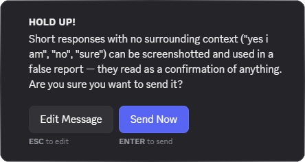

#  SafeGuard

A Vencord plugin designed to help protect against false bans from chat messages.



Discord has seemingly removed humans from their support team.
This makes false bans much more common and much more difficult to appeal.
This plugin aims to help you protect yourself from these false bans.

## Features
### Message intercepting
- Intercepts potentially problematic messages and prevents them from being sent.
- Modal popup to explain why the message was blocked.
- Option to send anyway
### Risk Detection
- Ambiguous messages without context like "yes", "i did", "i am" that can have their context message edited to cause a ban
- Age implication messages like "turning 12" or "11"
- Hate speech messages with a range of racial, religious, homophobic, transphobic, sexist, and disability related words
- Threatening messages that convey physical harm, sexual violence, doxxing, blackmail, and similar language
- Self Harm encouragement messages
- Grooming like messages that could imply potential grooming, such as urging secrecy
- Solicitation messages that could imply requests for adult imagery
- Raid/Spam messages that could imply organizing a server raid or spam campaign
### Channel whitelisting
- Whitelist channels you trust so you won't see SafeGuard modals
### Settings
- Enable or disable any category of messages
- Comma separated custom word list

## Installation
1. [Build Vencord](https://docs.vencord.dev/installing/)
2. Clone this repository
    ```bash
    git clone https://github.com/RenVencord/SafeGuard.git
    ```
3. Copy the `SafeGuard` folder into `Vencord/src/userplugins`
